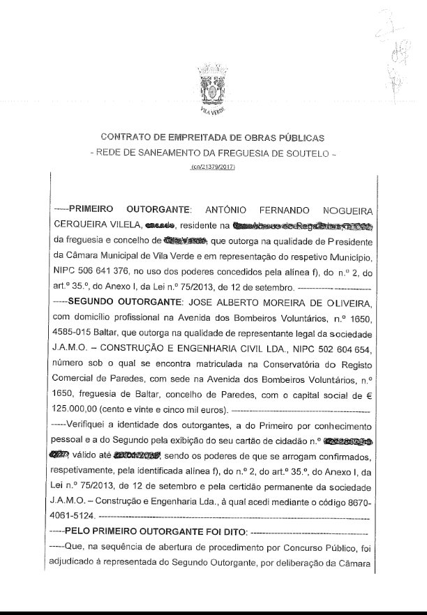
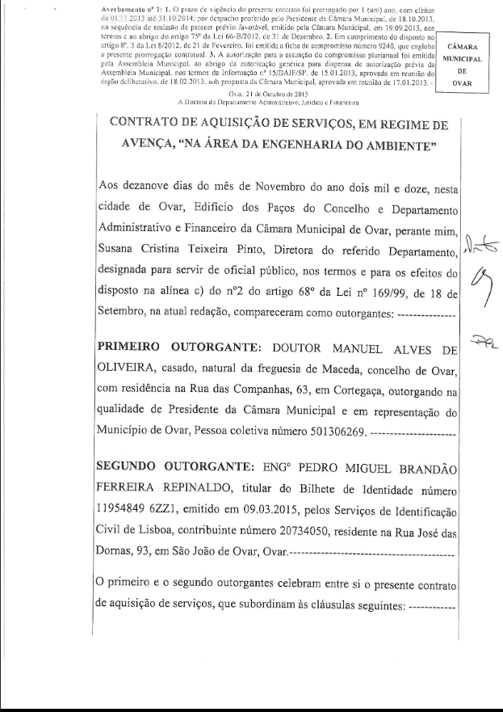

# Glass Base

Glass base is essentially a web dashboard to visualize data from the [Portuguese government public contract platform](https://www.base.gov.pt). This application stores, serves and presents information in a digestible user friendly way.

The term 'glass' in Glass Base comes from the idea of glass houses, where everyone can see what is going on inside. We have decided on this name since the goal of this project is to be transparent on the cashflow of public money.

What is important from this repository is the rough [Base Gov REST API documentation](#base-gov-rest-api). Feel free to use it for your own projects.

## Architecture

We are using docker compose for spawning the necessary services. However, it has been a year since I've worked on this, and I forgot :sob: .

## Base Gov REST API

In the following sections you can find the necessary documentation for understanding Base Gov's API.

:rotating_light: Keep in mind that the Base Gov REST API server tends to malfunction if you bombard it with requests, please use in with caution :rotating_light:.

### Early disclaimer

Be aware that some data **might not be consistent** on Base Gov's side. I have found cases where the SAME entity appears more than once, with different tax number values, for example:

```json
// in one entry
"contracted": [
    {
      "nif": "123456789", // <--- Correct Tax number
      "description": "Some Company",
      "id": 1
    }
],
// in another entry
"contracted": [
    {
      "nif": "", // <--- empty string
      "description": "Some Company",
      "id": 2
    }
],
// in yet another entry
"contracted": [
    {
      "nif": " ", // <--- String with space
      "description": "Some Company",
      "id": 3
    }
],
```

### Contracts

Contracts are the soul of the data. They have information on the entities which

- URL
    - General: `http://www.base.gov.pt/base2/rest/contratos`
    - Specific: `http://www.base.gov.pt/base2/rest/contratos/:id`
- Headers (used for pagination)
    - `Range: '{start range}-{end range}'`, for example `Range: '0-19'` for the first 20 contracts

Example of the first 20 contracts:

```json
[
  {
    "contracted": "Ana Sofia Francisco Tomás",
    "contracting": "Câmara Municipal da Lousã",
    "contractingProcedureType": "Ajuste Direto Regime Geral",
    "publicationDate": "14-08-2008",
    "objectBriefDescription": "Elaboração das fichas de mão-de-obra, de máquinas e viaturas, para posterior inserção na aplicação informática – Contabilidade de Custos",
    "initialContractualPrice": "6.360,10 €",
    "signingDate": null,
    "id": 20
  },
  {
    "contracted": "Link Consulting, S.A",
    "contracting": "Câmara Municipal da Nazaré",
    "contractingProcedureType": "Ajuste Direto Regime Geral",
    "publicationDate": "14-08-2008",
    "objectBriefDescription": "Aquisição de 1.000 Cartões Contactless para o Sistema de Cartão Inteligente Multi-Serviços (CIM-3); de 1 Scanner HP Scanjet 5590 digital flatbed scanner; de 3 fital Half para impressora e de 1 Kit de ...",
    "initialContractualPrice": "5.611,10 €",
    "signingDate": null,
    "id": 21
  },
    ...
]
```

Example of specific contract with `id = 4066513`

```json
{
  "frameworkAgreementProcedureId": "Não aplicável.",
  "documents": [
    {
      "description": "CONTRATO ASSINADO.pdf",
      "id": 342537
    }
  ],
  "ambientCriteria": false,
  "announcementId": -1,
  "directAwardFundamentationType": "ausência de recursos próprios",
  "contractingProcedureUrl": null,
  "observations": null,
  "invitees": [],
  "publicationDate": "29-12-2017",
  "endOfContractType": null,
  "totalEffectivePrice": null,
  "contestants": [],
  "contractFundamentationType": "Artigo 20.º, n.º 1, alínea a) do Código dos Contratos Públicos",
  "increments": false,
  "closeDate": null,
  "causesDeadlineChange": null,
  "causesPriceChange": null,
  "frameworkAgreementProcedureDescription": "Não aplicável.",
  "contracted": [
    {
      "nif": "251393828",
      "description": "Lénia Cristina Fernandes Mestrinho",
      "id": 2352209
    }
  ],
  "contracting": [
    {
      "nif": "501559094",
      "description": "Universidade Nova de Lisboa",
      "id": 9247
    }
  ],
  "contractingProcedureType": "Ajuste Direto Regime Geral",
  "contractTypes": "Aquisição de serviços",
  "executionDeadline": "60 dias",
  "cpvs": "72000000-5, Serviços de TI: consultoria, desenvolvimento de software, Internet e apoio",
  "contractTypeCS": false,
  "objectBriefDescription": "Aquisição de um serviço de consultoria para assessoria ao Ministério de Justiça na definição de um método de informação aos serviços financeiros.",
  "income": false,
  "centralizedProcedure": false,
  "executionPlace": "Portugal, Lisboa, Lisboa",
  "nonWrittenContractJustificationTypes": "",
  "initialContractualPrice": "21.000,00 €",
  "contractStatus": null,
  "signingDate": "22-11-2017",
  "cocontratantes": false,
  "description": "Aquisição de um serviço de consultoria para assessoria ao Ministério de Justiça na definição de um método de informação aos serviços financeiros.",
  "id": 4066513
}
```

### Entities

Entities are people or organizations that contract or are contracted.

- URL
    - General: `http://www.base.gov.pt/base2/rest/entidades`
    - Specific: `http://www.base.gov.pt/base2/rest/entidades/:id`
- Headers (used for pagination)
    - `Range: '{start range}-{end range}'`, for example `Range: '0-19'` for the first 20 contracts

Example of the first 20 entities:

```json
[
    {
        "nif":"501121528",
        "description":"Município da Lousã",
        "id":45,
        "country":"Portugal"
    },
   {
        "nif":"506676056",
        "description":"Município de Benavente",
        "id":56,
        "country":"Portugal"
    },
    ...
]
```

Example of specific entity with `id = 287467`

```json
{
    "sumTotalContractsGiven":"134.271.750,57 €",
    "sumTotalContractsReceived":"10.500,00 €",
    "totalContractsGiven":3826,
    "totalContractsReceived":1,
    "nif":"509822940",
    "description":"Centro Hospitalar Tondela-Viseu, E. P. E.",
    "location":"Portugal,Viseu,Viseu",
    "id":287467
}
```

### Documents

Documents are usually PDF files of the signed contract between the 2 entities.

- URL
    - Specific: `http://www.base.gov.pt/base2/rest/documentos/:id`

Example of specific contract with `id = 342531`



### Aditamentos

Aditamentos are usually PDF files of additions to the signed contract between the 2 entities.

- URL
    - Specific: `http://www.base.gov.pt/base2/rest/aditamentos/:id`

Example of specific contract with `id = 123`



### Dispatches

- URL
    - General: `http://www.base.gov.pt/base2/rest/despachos`
    - Specific: `http://www.base.gov.pt/base2/rest/despachos/:id`
- Headers (used for pagination)
    - `Range: '{start range}-{end range}'`, for example `Range: '0-19'` for the first 20 dispatches

Example of the first 20 dispacthes:

```json
[
  {
    "publicationDate": "17-02-2009",
    "summary": "Aprova a lista de investimentos considerados prioritários que respeitam às escolas identificadas no anexo i ao presente despacho, do qual faz parte integrante",
    "issuer": "Gabinete da Ministra da Educação\nMinistério da Educação",
    "id": 1
  },
  {
    "publicationDate": "17-04-2009",
    "summary": "Eficiência energética",
    "issuer": "MINISTÉRIOS DAS FINANÇAS E DA ADMINISTRAÇÃO PÚBLICA E DA ECONOMIA E DA INOVAÇÃO",
    "id": 2
  },
  ...
]
```

Example of specific dispatch with `id = 1`

```json
{
  "publicationDate": "17-02-2009",
  "diplomaNumber": "5395/2009",
  "drNumber": "33",
  "drSeries": "2",
  "supplement": "0",
  "summary": "Aprova a lista de investimentos considerados prioritários que respeitam às escolas identificadas no anexo i ao presente despacho, do qual faz parte integrante",
  "issuer": {
    "nif": "600015467",
    "description": "Gabinete da Ministra da Educação\nMinistério da Educação",
    "id": 0
  },
  "diplomaType": "Despacho",
  "part": "C",
  "reference": "http://dre.pt/util/getpdf.asp?s=dip&serie=2&iddr=33.2009&iddip=2009012664",
  "id": 1
}
```

### Anúncios

Entities are people or organizations that contract or are contracted.

- URL
    - General: `http://www.base.gov.pt/base2/rest/anuncios`
    - Specific: `http://www.base.gov.pt/base2/rest/anuncios/:id`
- Headers (used for pagination)
    - `Range: '{start range}-{end range}'`, for example `Range: '0-19'` for the first 20 contracts

Example of the first 20 anúncios:

```json
[
  {
    "drPublicationDate": "03-09-2009",
    "contractingProcedureType": "Concurso público",
    "contractDesignation": "Conservação do Pavimento da E.M. 18-3",
    "basePrice": "166.060,00 €",
    "contractingEntity": "Município de Belmonte",
    "proposalDeadline": "26-09-2009",
    "id": 1,
    "type": "Declaração de retificação de anúncio"
  },
  {
    "drPublicationDate": "01-09-2009",
    "contractingProcedureType": "Concurso público",
    "contractDesignation": "Construção do Posto Territorial da G.N.R. de Lordelo",
    "basePrice": "1.187.500,00 €",
    "contractingEntity": "Município de Paredes",
    "proposalDeadline": "26-09-2009",
    "id": 2,
    "type": "Anúncio de procedimento"
  },
  ...
]
```

Example of specific anúncio with `id = 1`

```json
{
  "modelType": "Concurso público",
  "ambientCriteria": false,
  "drPublicationDate": "03-09-2009",
  "contractDesignation": "Conservação do Pavimento da E.M. 18-3",
  "basePrice": "166.060,00 €",
  "contractingProcedureUrl": null,
  "cpvs": "45233141-9, Manutenção de estradas",
  "contractType": "Empreitadas de obras públicas",
  "contractingEntities": [
    {
      "nif": "506695956",
      "description": "Município de Belmonte",
      "id": 3816
    }
  ],
  "proposalDeadline": "23 dias.",
  "announcementNumber": "615/2009",
  "contractingProcedureAliasID": "82053",
  "dreSeries": "2",
  "cnccs": false,
  "impugnations": false,
  "maximumEstimatedValueUnderFrameworkAgreement": false,
  "contractsCount": 0,
  "contractingProcedureId": 154894,
  "dreNumber": "171",
  "reference": "http://dre.pt/util/getpdf.asp?s=udrcp&serie=2&data=2009-09-03&iddr=171&iddip=402245622",
  "id": 1,
  "type": "Declaração de retificação de anúncio"
}
```

### Incrementos

- URL
    - General: `http://www.base.gov.pt/base2/rest/incrementos`
- Headers (used for pagination)
    - `Range: '{start range}-{end range}'`, for example `Range: '0-19'` for the first 20 incrementos

Example of the first 20 incrementos:

```json
[
  {
    "contractingProcedureType": "Ajuste Direto Regime Geral",
    "publicationDate": "13-10-2009",
    "modificationDate": "30-09-2009",
    "newContractualPrice": "10.770,00 €",
    "initialPrice": "5.490,00 €",
    "contracting": "Câmara Municipal de Vizela",
    "description": "Aluguer de monoblocos (construção modular pré fabricada para sala de aulas)",
    "id": 2
  },
  {
    "contractingProcedureType": "Ajuste Direto Regime Geral",
    "publicationDate": "24-02-2011",
    "modificationDate": "03-01-2011",
    "newContractualPrice": "42.000,00 €",
    "initialPrice": "35.700,00 €",
    "contracting": "Associação Industrial do Minho",
    "description": "Assessoria Mediática do Programa QI-pme Norte",
    "id": 5
  },
  ...
]
```

